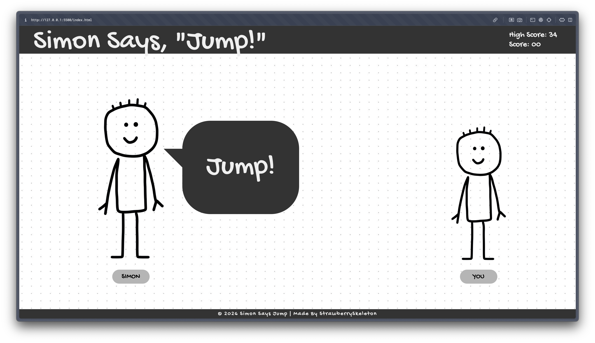

# Simon Says, "Jump!"
simon says endless game, where you jump on simon says and not jump on other simon says

## Features
- simon gives random action with preference to jump action
- jumping at space key press with matching sound effect
- background music
- start/end screen
- highscore stored locally on user computer
- tried to make it as aesthetic as possible with css effects etc.

## Screenshot

## Credits
- made by me
- chat bubble code reference: [https://projects.verou.me/bubbly/](https://projects.verou.me/bubbly/)
- font used: [Gochi Hand - google font](https://fonts.google.com/specimen/Gochi+Hand?query=handwriting&preview.script=Latn)
- stickman img: [rawpixel](https://images.rawpixel.com/image_png_800/cHJpdmF0ZS9sci9pbWFnZXMvd2Vic2l0ZS8yMDIzLTExL3Jhd3BpeGVsX29mZmljZV8yNV8xX3N0aWNrbWFuX3NtaWxpbmdfbWluaW1hbGlzdGljXzJkX2lzb2xhdGVkX19hMDI1ZGZhOC04OWE5LTRiOGYtOGMxMi02ZmE2NGYwMjE2YmUucG5n.png)
- bg img: [pinterest](https://in.pinterest.com/pin/703335666814602453/)
- jumping sound effect: [dragon-studio on pixabay](https://pixabay.com//?utm_source=link-attribution&utm_medium=referral&utm_campaign=music&utm_content=463196)
- bg music: [openmindaudio on pixabay](https://pixabay.com/sound-effects//?utm_source=link-attribution&utm_medium=referral&utm_campaign=music&utm_content=497394)

> ## AI Usage
> used ai to help debug the error where start button was not working, turns out it was because I changed the buttons' class name and didn't update the js